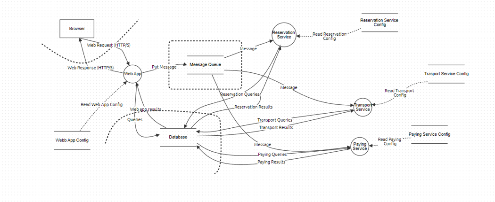

## 1. Motivacija napadača

- Potencijalni napadači i njihove motivacije

  1. **Konkurencija**: druge turističke organizacije mogu napasti MegaTravel kompaniju kako bi oštetili njenu reputaciju, poremetili pružanje usluga ili kako bi ukrali bazu klijenata. U zavisnosti od količine resursa i sofisticiranosti konkurentskih organizacija, njihov opšti nivo veštine može biti umeren do visok. Poslovni rivali se najpre mogu baviti prikupljanjem podataka o konkurenciji, zatim vršiti napade društvenog inžinjeringa ili distribuirane _denial-of-service_ (DDoS) napde kako bi poremetili poslovanje MegaTravel-a.
  2. **Hacktivists**: grupe ili pojedinci sa ideološkim ili političkim motivima, mogu izvršiti napad na MegaTravel kao oblik protesta protiv njegovog načina poslovanja, uticaja na životnu sredinu ili društvenih pitanja u vezi sa turizmom. Nivo veštine ove grupe varira, ali obuhvata pojedince sa umerenim do visokim tehničkim veštinama i snažnom ideološkom motivacijom. Njihovi napadi su najčešće _defacement_ veb stranica, DDoS napadi ili _data leaks,_ kako bi se privukla pažnja i promovisala njihova ideologija.
  3. **Cybercriminals**: ova klasa napadača ima za cilj da iskoristi ranjivost u sistemu radi finansijske dobiti. Mogu pokušati da ukradu podatke o klijentima, njihove finansijske informacije ili poslovne informacije, koje zatim mogu prodati ili ih iskoristiti za krađu identiteta. Opšti nivo veštine se i za ovu klasu razlikuje i može se kretati od niskokvalifikovanih osoba sa lako dostupnim alatima i skrptama za hakovanje do visoko kvalifikovanih i sofisticiranih napadača sposobnih da izvedu složene i prikrivene napade. U zavisnosti od visine tehničkog znanja koje napdač poseduje, tipovi napada mogu biti: _brute-force_ napadi, _phishing,_ iskorišćavanje poznatih ranjivosti standardnog softvera, SQL _injection, cross-site scripting_ (XSS) , napadi društvenog inžinjeringa...

Sve tri klase napadača imaju potencijal da oštete sistem ove organizacije, na različite načine i sa različitim motivacijama, bilo putem prekida usluga, krađe poverljivih podataka ili finansijske eksploatacije.

## 2. Imovina (assets)

- Lista osetljive imovine (a_ssets)_:

  1. Baza podataka klijenata
      - **Inherentna izloženost**: Zaposleni u određenim sektorima kao što su marketing, prodaja i korisnička podrška imaju pristup ovoj bazi podataka radi pružanja usluga klijentima.
      - **Bezbednosni ciljevi**: osigurati da samo ovlašćeni zaposleni imaju pristup podacima, osigurati da podaci nisu neovlašćeno menjani i osigurati da baza podataka bude dostupna kada je potrebno.
      - **Uticaj oštećenja**: Oštećenje ovih bezbednosnih ciljeva može rezultirati gubitkom poverenja klijenata, kršenjem propisa o zaštiti podataka (npr. GDPR) i finansijskim gubicima zbog kazni i gubitka klijenata.
  2. Sistem za rezervaciju smeštaja
      - **Inherentna izloženost**: Zaposleni u sektorima rezervacija i administracije imaju pristup ovom sistemu kako bi upravljali rezervacijama klijenata.
      - **Bezbednosni ciljevi:** osigurati da podaci o rezervacijama budu zaštićeni, osigurati da rezervacije nisu promenjene bez dozvole i osigurati da sistem bude dostupan za rezervacije.
      - **Uticaj oštećenja:** Oštećenje ovih bezbednosnih ciljeva može rezultirati gubicima rezervacija, povećanim  troškovima kompenzacije klijentima i oštećenjem reputacije zbog lošeg korisničkog iskustva.
  3. Sistem za upravljanje transportom
      - **Inherentna izloženost**: Zaposleni u sektorima transporta i logistike imaju pristup ovom sistemu kako bi upravljali transportom klijenata.
      - **Bezbednosni ciljevi**: osigurati da informacije o transportu budu zaštićene, osigurati da podaci o transportu nisu promenjeni bez dozvole i osigurati da sistem bude dostupan za upravljanje transportom.
      - **Uticaj oštećenja**: Oštećenje ovih bezbednosnih ciljeva može rezultirati kašnjenjem ili otkazivanjem transporta klijenata, gubicima rezervacija i nezadovoljstvom klijenata.
  4. Finansijski sistemi i podaci
      - **Inherentna izloženost**: Finansijski timovi i viši menadžeri imaju pristup finansijskim sistemima i podacima radi upravljanja poslovanjem.
      - **Bezbednosni ciljevi**: osigurati da finansijski podaci budu zaštićeni, osigurati da finansijski podaci nisu neovlašćeno promenjeni i osigurati da sistemi za obradu plaćanja budu dostupni kada je potrebno.
      - **Uticaj oštećenja**: Oštećenje ovih bezbednosnih ciljeva može rezultirati finansijskim gubicima, kršenjem propisa o finansijskom izveštavanju i oštećenjem reputacije zbog gubitka poverenja investitora i klijenata.
  5. Informacioni sistem za planiranje odmora
      - **Inherentna izloženost**: Zaposleni u sektorima planiranja i organizacije odmora imaju pristup ovom sistemu kako bi pružili personalizovane usluge klijentima.
      - **Bezbednosni**** ciljevi**: osigurati da informacije o planiranju odmora budu zaštićene, osigurati da planovi odmora nisu promenjeni bez dozvole i osigurati da sistem bude dostupan za planiranje odmora.
      - **Uticaj oštećenja**: Oštećenje ovih bezbednosnih ciljeva može rezultirati nezadovoljstvom klijenata, gubicima rezervacija i lošim korisničkim iskustvom.
  6. Korporativna intelektualna svojina:
      - **Inherentna izloženost**: Zaposleni u istraživačko-razvojnom sektoru ili menadžeri proizvoda imaju pristup korporativnoj intelektualnoj svojini kao što su inovativne ideje, planovi proizvoda ili marketinške strategije.
      - **Bezbednosni ciljevi**: osigurati da korporativna intelektualna svojina ostane zaštićena i tajna, osigurati da informacije nisu neovlašćeno promenjene i osigurati da pristup svojini bude kontrolisan.
      - **Uticaj oštećenja**: Oštećenje ovih bezbednosnih ciljeva može rezultirati gubitkom konkurentske prednosti, smanjenjem inovativnosti, gubicima na tržištu i pravnim sporovima.
  7. Interni komunikacioni sistemi:
      - **Inherentna izloženost**: Zaposleni na svim nivoima organizacije koriste interne komunikacione sisteme kao što su e-pošta i interni četovi za razmenu informacija.
      - **Bezbednosni ciljevi**: osigurati privatnost internih komunikacija, osigurati da poruke nisu neovlašćeno menjane i osigurati da interni komunikacioni sistemi budu dostupni za rad.
      - **Uticaj oštećenja**: Oštećenje ovih bezbednosnih ciljeva može rezultirati curenjem osetljivih informacija I smanjenjem produktivnosti zaposlenih.
  8. Softverski kod i arhitektura sistema:
      - **Inherentna izloženost**: Softverski inženjeri i arhitekte imaju pristup kodu i arhitekturi sistema radi razvoja i održavanja softvera.
      - **Bezbednosni ciljevi**: osigurati zaštitu autorskih prava i tajnosti kodnog sistema, osigurati da kod nije neovlašćeno promenjen i osigurati da pristup kodu i arhitekturi bude kontrolisan.
      - **Uticaj oštećenja**: Oštećenje može rezultirati smanjenjem pouzdanosti softvera, ranjivostima sistema, krađom intelektualne svojine i gubicima poverenja korisnika.

  9. Finansijski podaci klijenata:
      - **Inherentna izloženost**: Finansijski timovi i sektori kao što su računovodstvo imaju pristup finansijskim podacima klijenata radi obrade plaćanja, fakturisanja i upravljanja računima.
      - **Bezbednosni ciljevi**: osigurati da finansijski podaci klijenata budu zaštićeni, osigurati da podaci nisu neovlašćeno promenjeni I osigurati da finansijski sistemi budu dostupni za obradu transakcija.
      - **Uticaj oštećenja**: Oštećenje ovih bezbednosnih ciljeva može dovesti do krađe identiteta, zloupotrebom finansijskih informacija, bankarskim prevarama i finansijskim gubicima za klijente i korporaciju.

## 3. Površina napada (attack surface)

- Lista korisnika koji interagiraju sa sistemom.

  1. **Klijenti**:

      Klijenti komuniciraju sa sistemom putem veb stranice ili mobilnih aplikacija radi rezervacije smeštaja, transporta i planiranja odmora.

  2. **Zaposleni**:

      Zaposleni koriste interni sistem za upravljanje rezervacijama, administraciju, finansije i komunikaciju.

  3. **Poslovni partneri**:

      MegaTravel može imati poslovne partnere kao što su hotelski lanci, aviokompanije i agencije za iznajmljivanje vozila, koji mogu imati interakciju sa sistemom radi razmene podataka i usluga.

  4. **Finansijske institucije**:

      Finansijske institucije se mogu povezati sa sistemom radi procesuiranja plaćanja klijenata.

  5. **Neprijateljski entiteti**:

      Napadači spolja mogu pokušati da izvrše napade na sistem putem različitih metoda, uključujući DDoS napade, pokušaje proboja, pokušaje krađe identiteta ili prevaru korisnika.

#### Lista ulaznih tačaka na osnovu korisnika aplikacije:

- Veb stranica
- Mobilne aplikacije
- Interni softverski alati i aplikacije
- API-ji (Interfejsi za programiranje aplikacija) ili druge integracione tačke
- Integracija sa sistemima za obradu plaćanja (npr. procesori kartica, bankovni API-ji)
- Mrežne komunikacije
- Direktan pristup bazi podataka

## 4. Dijagram

## 5. Analiza pretnji i mitigacije
1. Komunikacija pretraživača sa „Web App"

      - Pretnje:

        - Man in the middle
        - Data iterception
        - Session Hijacking
        - Cross-Site Scripting (XSS) napadi

      - Mitigacije:

        - Implementacija HTTPS/TLS šitfrovane komunikacije
        - Implementacija mehanizme zaštite od CSRF napada
        - Implementacija validacije input-a i output-a kako bi sprečili XSS napade

  2. Komunikacija „Web App" sa drugim servisima pomoću ekternog brokera

      - Pretnje:

        - Neautorizovan pristup topiku ili brokeru
        - Message Replay attack
        - MitM napadi
        - Message Queue Overflow
        - DDoS napadi

      - Mitigacije:

        - Implementacija autentifikacije i autorizacije
        - Implementirati proveru integriteta poruka
        - Koristiti vreme isteka poruka za sprečavanje ponovnog reprodukovanja
        - Redovno ažuriranje softvera
        - Implementirati ograničenje veličine message queue-a

  3. Komunikacija servisa sa bazom podataka

      - Pretnje:

        - SQL Injection
        - Curenje podataka
        - Neautorizovan pristup bazi podataka

      - Mitigacije:

        - Koristiti ORM framework ili parametrizovane upite
        - Implementacija kontrole pristupa sa minimalnim brojem privilegija
        - Šifrovati osetljive podatke u bazi, kao i prilikom komunikacije
        - Redovno vršiti provere i praćenje logova pristupa bazi
        - Validirati ulazne podatke

  4. Opšte mere bezbednosti

      - Implementacija autentifikacije i autorizacije, kako za pristup servisima tako i za pristup bazi podataka
      - Koristiti „Rate limiting" i „Throttling" za odbranu od DoS napada
      - Redovno ažurirati softver
      - Pratiti logove kako bi se detektovalo sumnjivo ponašanje
      - Obučavanje radnika o praksama pisanja bezbednog koda
